[TOC]

## Intellij 프로젝트 구조

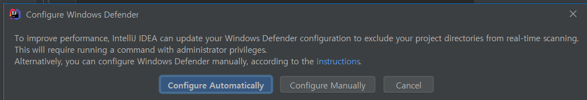

> gradle 내용 바뀌면 자동으로 바뀌게 설정하기


---

intellij - project / module

> intellj는 workspace개념이 없이, 멀티모듈구조로 여러 모듈이 들어감
>
> 그게 하나의 프로젝트로 보면됨 -> 프로젝트가 워크스페이스임
>
> Jetbrains에서 지원하는 모든 모듈이 프로젝트 밑에 들어갈수있음 
>
> 같은프로젝트 밑에 모듈로 
>
> ex) 안드로이드 프로젝트, 파이썬 프로젝트, 자바 프로젝트... 등을 넣을 수 있음

```
intellij	VS		Eclipse
project				workspace
module				project
					module
```

<br>

## Intellj jdk 설정

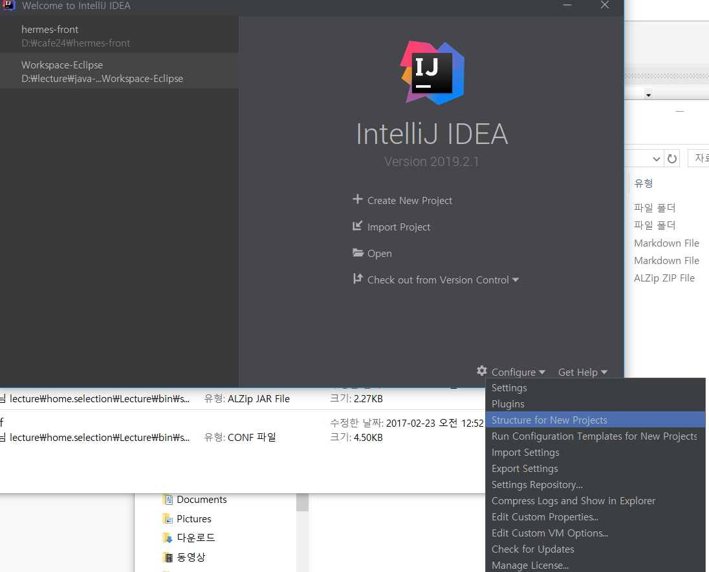

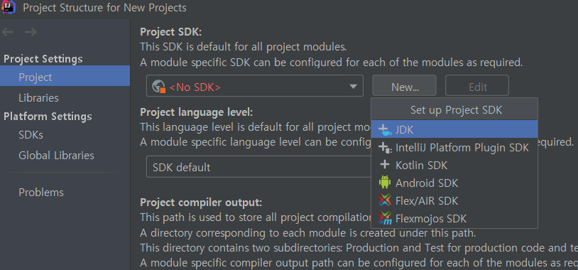

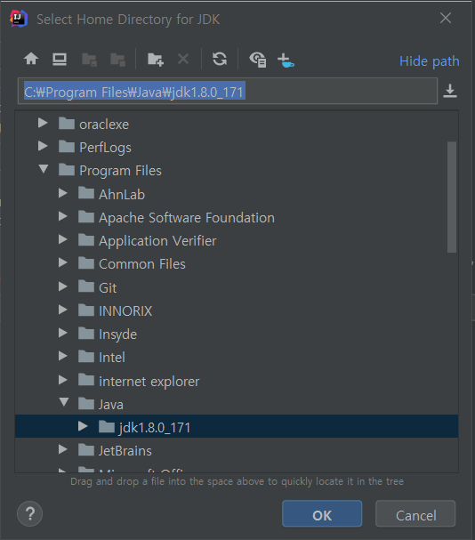

<br>

## 기본 settings - spelling

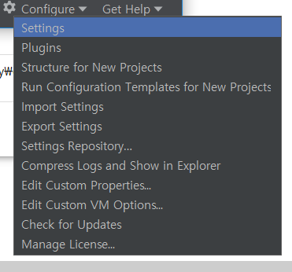

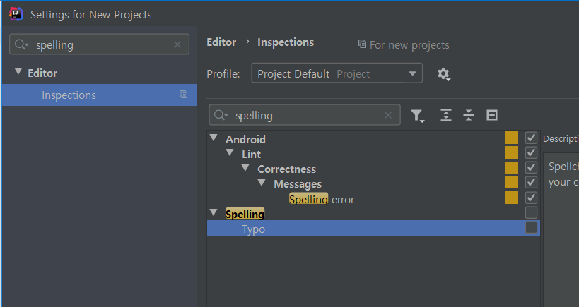


<br>

## Vue랑 Gradle 플러그인 설치 확인하기!

### - 내가 필요한 플러그인 설치

<br>

## gradle : project structure 

## = eclipse : project properties / java build path

그래들의 프로젝트 설정은 project structure에서 할 수 있다.

단축키 : `ctrl + shift + alt + s`

<br>

## project 3개 만들어 보기

> (gradle-examples) vs (maven-examples) vs (native-examples)
>
> 3개 프로젝트로 이클립스와 비교하면서 실습!

<br>

**프로젝트 생성은 new - project**

---

메이븐 프로젝트 생성하기 - maven-examples

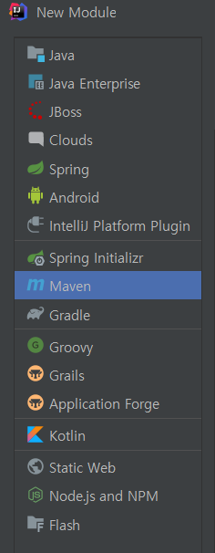ㅌ	

maven build

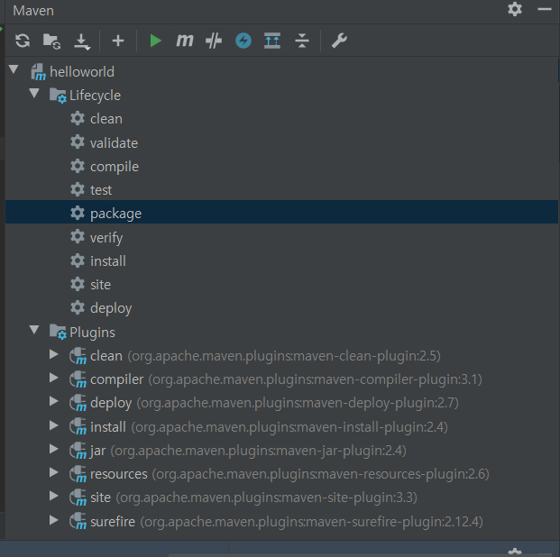


## maven-jar로 실행할때

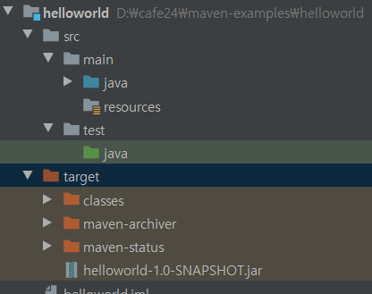

.\target\helloworld-1.0-SNAPSHOT.jar 밑에 class실행할때 **(소켓채팅할때 이렇게 했었음)**

```
D:\cafe24\maven-examples\helloworld>java -cp .\target\helloworld-1.0-SNAPSHOT.jar com.jung.helloworld.HelloWorld

> Hello World!
```

<br>

---

## gradle 프로젝트 생성하기

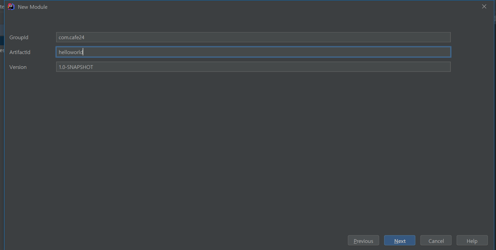


### bulid.gradle에서 dependency설정

-> pom.xml의 dependency 설정과 비슷! 

-> 원하는 디펜던시 `alt+insert`로 검색해서 넣을 수 있다.

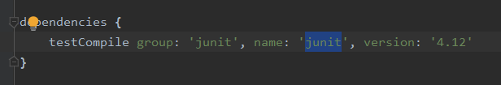

> ```
> gradle		VS	maven
> testComplie =>  scope
> 
> group 		=>  groupId
> 
> name 		=>  artificID
> 
> version 	=>  version
> ```
>
> 

<br>

### run task 설정하기

maven과 비교할 gradle IDEA 단독실행 모드 이해 필 수 ! 

**settings에서 설정**

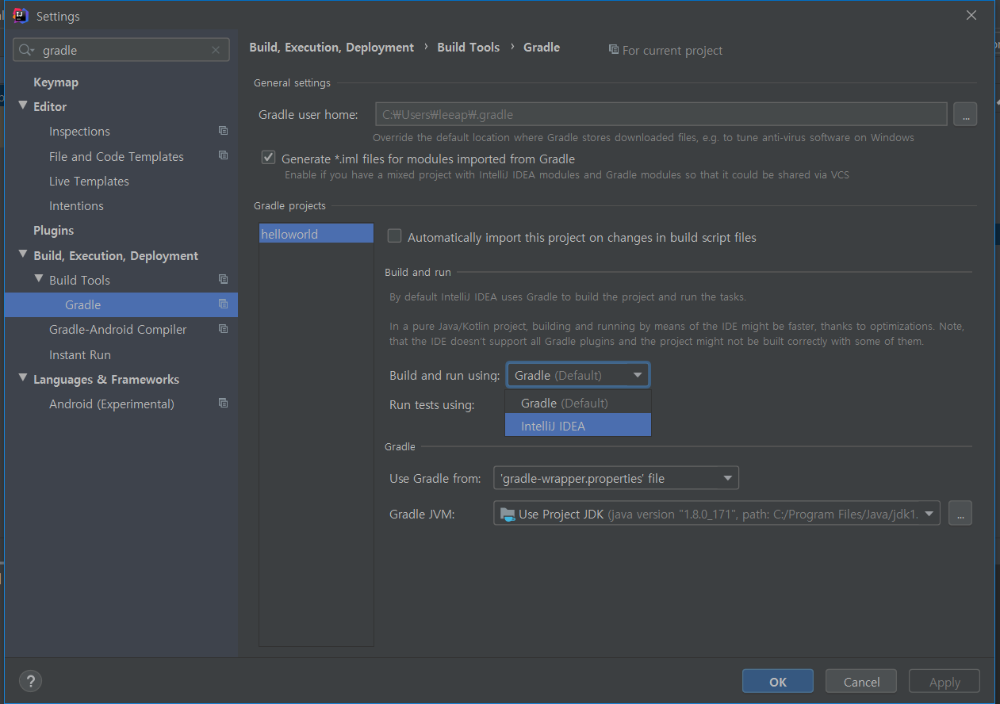

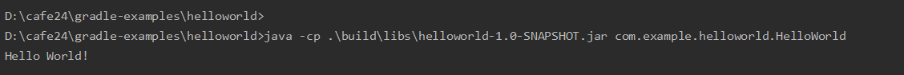


