**[참고자료]**

https://easy-h.tistory.com/25

https://jjeong.tistory.com/1326

https://gist.github.com/somecuitears/6b8d3876e4a6e8b954e41fe69e52ffda

---

[TOC]

## 프로젝트 생성

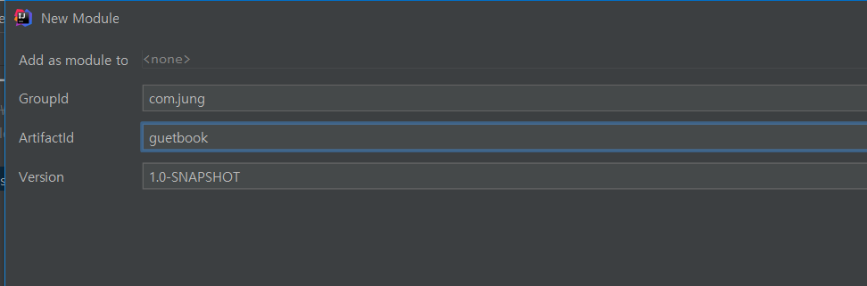

<br>

## 1 web 설정

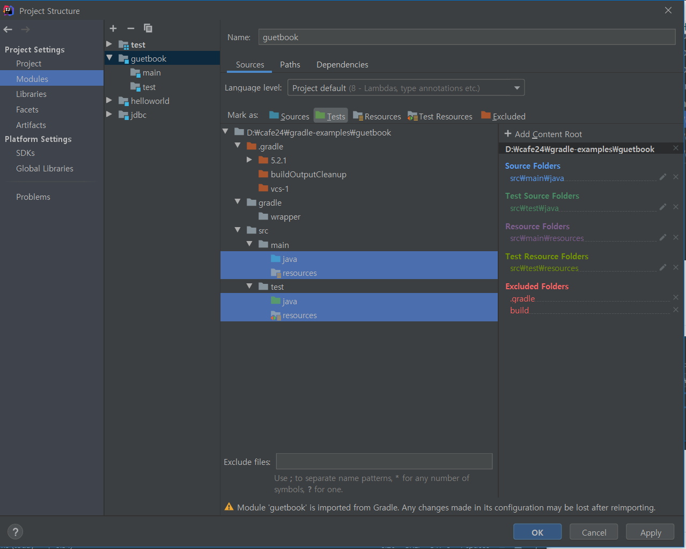


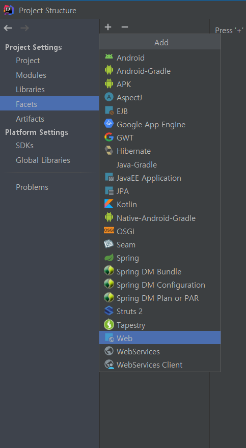


## Facets - Web 추가 후 수정

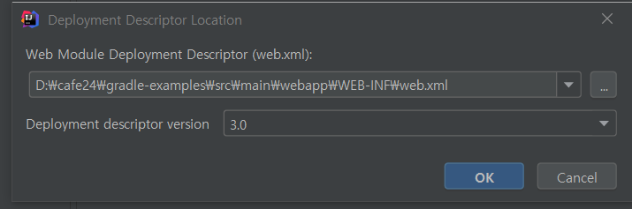

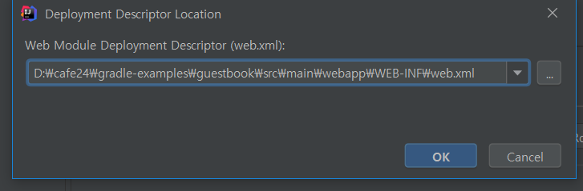

<br>

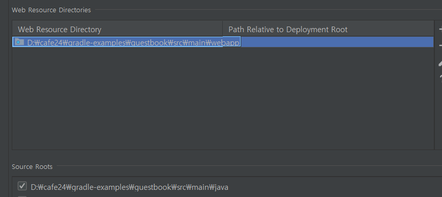


**web.xml**

```xml
<?xml version="1.0" encoding="UTF-8"?>
<web-app xmlns:xsi="http://www.w3.org/2001/XMLSchema-instance"
         xmlns="http://java.sun.com/xml/ns/javaee"
         xsi:schemaLocation="http://java.sun.com/xml/ns/javaee http://java.sun.com/xml/ns/javaee/web-app_3_0.xsd"
         version="3.0">
    <display-name>guestbook</display-name>
 
    <welcome-file-list>
        <welcome-file>index.html</welcome-file>
        <welcome-file>index.htm</welcome-file>
        <welcome-file>index.jsp</welcome-file>
        <welcome-file>default.html</welcome-file>
        <welcome-file>default.htm</welcome-file>
        <welcome-file>default.jsp</welcome-file>
    </welcome-file-list>

</web-app>
```

**index.jsp 만들기**


server run

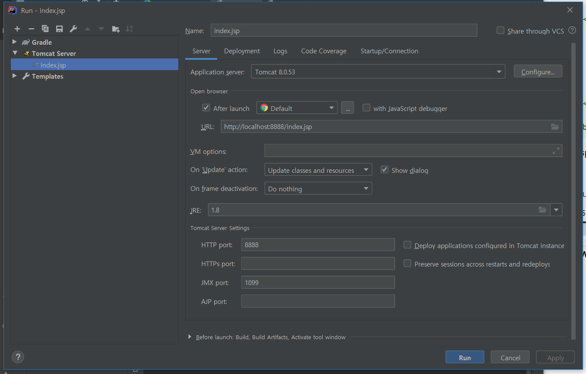

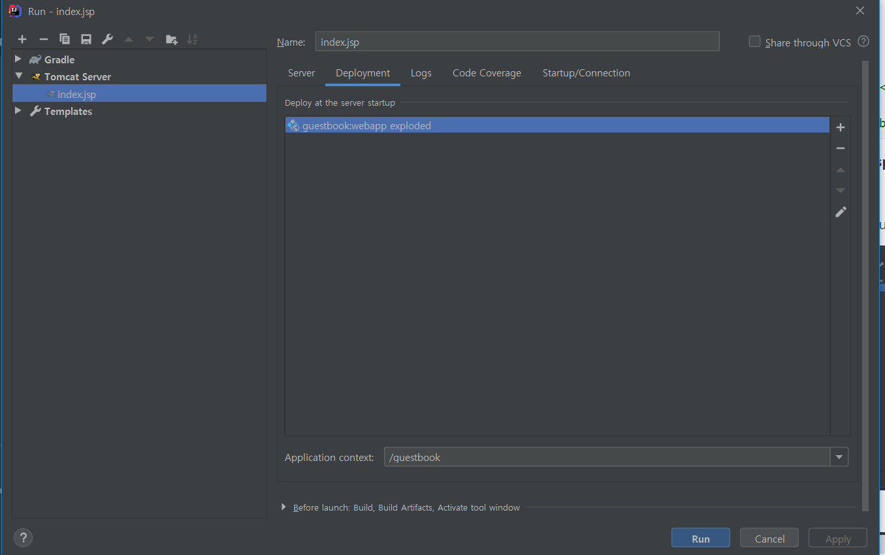


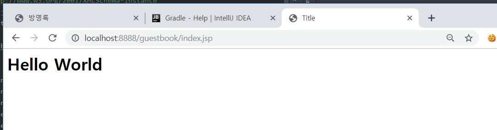

---

---

## build.gradle 설정

alt+insesrt

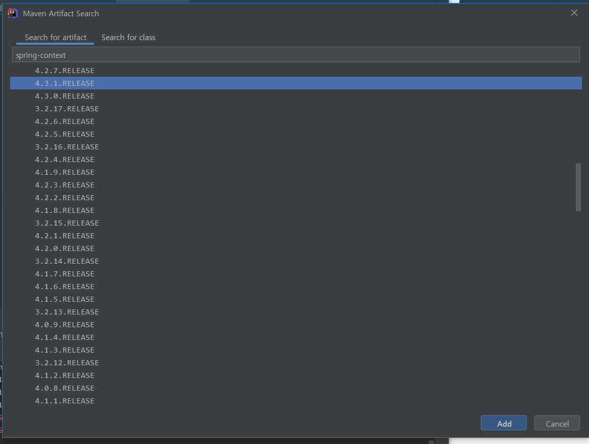

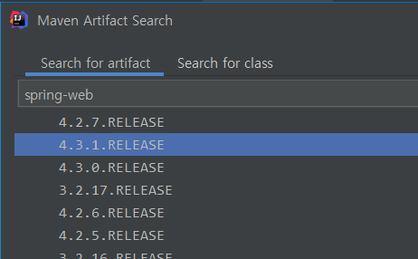

build.gradle

```properties
plugins {
    id 'java'
}

apply plugin: 'java'
apply plugin: 'war'

group 'com.jung'
version '1.0-SNAPSHOT'

sourceCompatibility = 1.8
targetCompatibility = 1.8

repositories {
    mavenCentral()
}

[compileJava, compileTestJava]*.options*.encoding = 'UTF-8'

dependencies {
    compile 'org.springframework:spring-context:4.1.6.RELEASE'
    compile 'org.springframework:spring-web:4.1.6.RELEASE'
    compile 'org.springframework:spring-webmvc:4.1.6.RELEASE'
    compile 'javax.servlet:jstl:1.2'
    compile 'org.springframework:spring-aspects:4.1.6.RELEASE'
    compile 'org.springframework:spring-jdbc:4.1.6.RELEASE'
    compile 'commons-dbcp:commons-dbcp:1.4'
    compile 'mysql:mysql-connector-java:8.0.16'
    compile 'org.mybatis:mybatis:3.2.2'
    compile 'org.mybatis:mybatis-spring:1.2.0'
    compile 'com.fasterxml.jackson.core:jackson-databind:2.9.8'
    compile 'com.fasterxml.jackson.module:jackson-module-parameter-names:2.9.8'
    compile 'org.slf4j:jcl-over-slf4j:1.7.6'
    compile 'ch.qos.logback:logback-classic:1.1.11'

    testCompile group: 'junit', name: 'junit', version: '4.12'
    testCompile 'org.springframework:spring-test:4.1.6.RELEASE'
    testCompile 'org.mockito:mockito-all:1.10.19'
    testCompile 'org.hamcrest:hamcrest-all:1.3'
    testCompile 'com.jayway.jsonpath:json-path:2.4.0'

    providedCompile 'javax.servlet:javax.servlet-api:3.0.1'
    providedCompile 'javax.servlet.jsp:jsp-api:2.0'
}


```


> build.gradle에 war로묶는 
>
> `apply plugin: 'war'` 게 있었어야함!!


