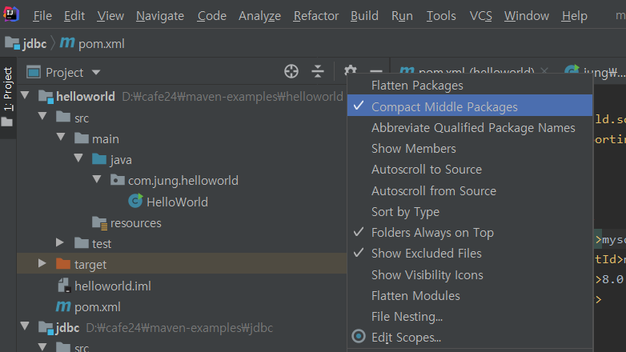
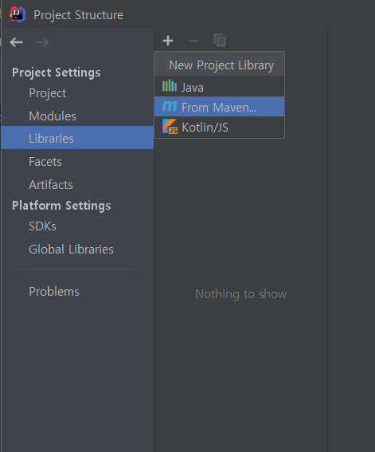
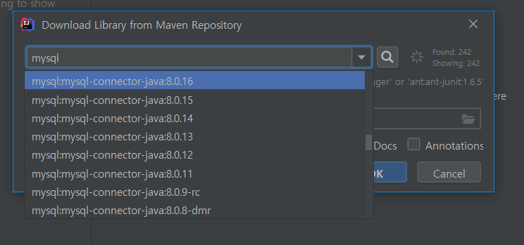
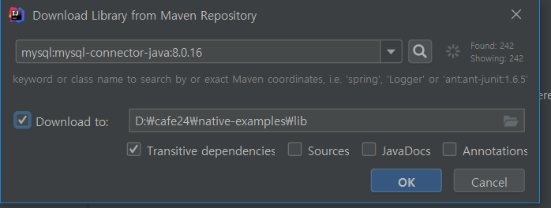
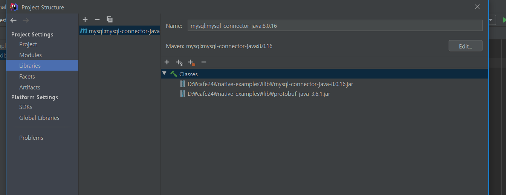
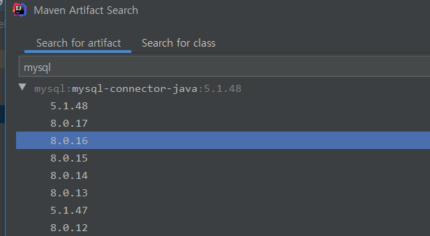
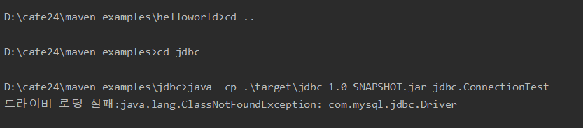
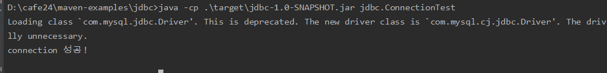
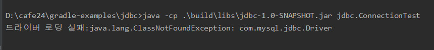
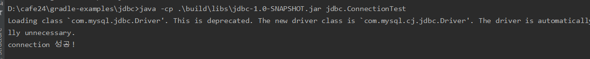

[TOC]

---

인텔리 제이에서 패키지 복사할떄는



풀고 복사해야함

---


## jdbc

native-project -> 라이브러리 추가










## maven

pon.xml

```xml
<?xml version="1.0" encoding="UTF-8"?>
<project xmlns="http://maven.apache.org/POM/4.0.0"
         xmlns:xsi="http://www.w3.org/2001/XMLSchema-instance"
         xsi:schemaLocation="http://maven.apache.org/POM/4.0.0 http://maven.apache.org/xsd/maven-4.0.0.xsd">
    <modelVersion>4.0.0</modelVersion>

    <groupId>com.jung</groupId>
    <artifactId>jdbc</artifactId>
    <version>1.0-SNAPSHOT</version>

    <properties>
        <project.build.sourceEncoding>UTF-8</project.build.sourceEncoding>
        <project.reporting.outputEncoding>UTF-8</project.reporting.outputEncoding>
    </properties>

    <dependencies>
        <dependency>
            <groupId>mysql</groupId>
            <artifactId>mysql-connector-java</artifactId>
            <version>8.0.16</version>
        </dependency>
    </dependencies>

    <build>
        <sourceDirectory>src/main/java</sourceDirectory>
        <plugins>

            <plugin>
                <artifactId>maven-compiler-plugin</artifactId>
                <version>3.8.0</version>
                <configuration>
                    <source>1.8</source>
                    <target>1.8</target>
                </configuration>
            </plugin>
        </plugins>
    </build>


</project>
```



<br>

maven 라이브러리-> lib 밑에 넣어야 실행가능



.m2밑에 있는 라이브러리를 프로젝트 내에 넣는다. 

> `${project.build.directory}/lib`

```xml
<plugin>
    <groupId>org.apache.maven.plugins</groupId>
    <artifactId>maven-dependency-plugin</artifactId>
    <executions>
        <execution>
            <id>copy-dependencies</id>
            <phase>prepare-package</phase>
            <goals>
                <goal>copy-dependencies</goal>
            </goals>
            <configuration>
                <outputDirectory>${project.build.directory}/lib</outputDirectory>
                <overWriteReleases>false</overWriteReleases>
                <overWriteSnapshots>false</overWriteSnapshots>
                <overWriteIfNewer>true</overWriteIfNewer>
            </configuration>
        </execution>
    </executions>
</plugin>
```

lib밑에도 jar에 같이 묶는 설정도 해줘야함

```xml
<plugin>
    <groupId>org.apache.maven.plugins</groupId>
    <artifactId>maven-jar-plugin</artifactId>
    <version>3.1.0</version>
    <configuration>
        <archive>
            <manifest>
                <classpathPrefix>lib/</classpathPrefix>
                <addClasspath>true</addClasspath>
                <mainClass>com.example.jdbc.ConnectionTest</mainClass>
            </manifest>
        </archive>
    </configuration>
</plugin>
```

성공!!!!!!!!




---

## gradle

**build.gradle**

```properties
tasks.withType(JavaCompile) {
    options.encoding = 'UTF-8'
}

dependencies {
    testCompile group: 'junit', name: 'junit', version: '4.12'
    compile 'mysql:mysql-connector-java:8.0.16'
}
```

여기서도 플러그인 jar를 override해줘야함



```properties
jar {
    manifest {
        attributes 'Main-Class': 'jdbc.ConnectionTest'
    }
    from {
        configurations.compile.collect { it.isDirectory() ? it : zipTree(it) }
    }
}
```




