[TOC]

## Intellij

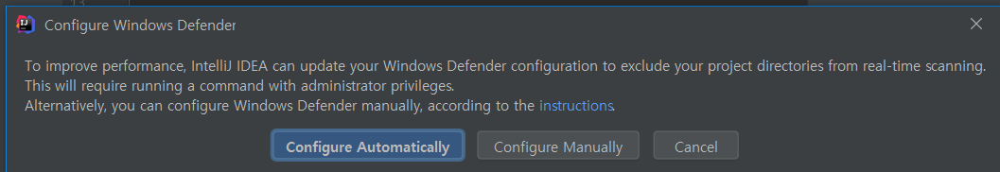

> gradle 내용 바뀌면 자동으로 바뀌게 

---

intellij - project / module

> intellj는 workspace개념이 없이, 멀티모듈구조로 여러 모듈이 들어감
>
> 그게 하나의 프로젝트로 보면됨 -> 프로젝트가 워크스페이스임
>
> Jetbrains에서 지원하는 모든 모듈이 프로젝트 밑에 들어갈수있음 ex) 안드로이드, 파이썬, 자바 ...

eclipse - workspace / project / module


## Intellj jdk 설정

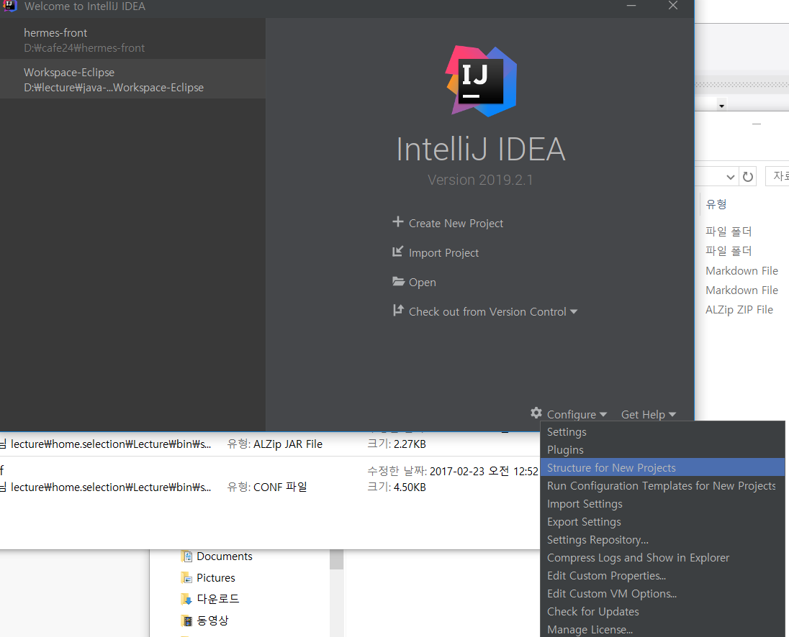

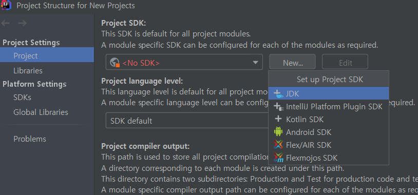

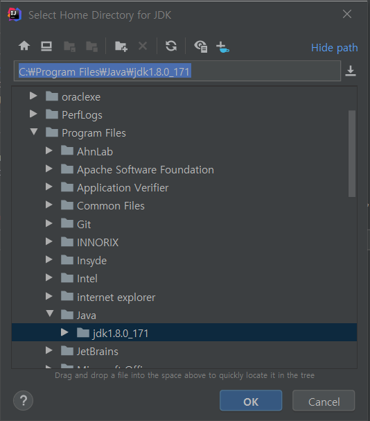


## settings - spelling

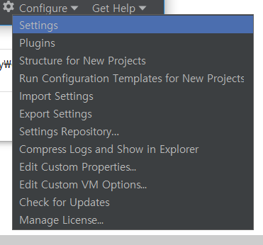

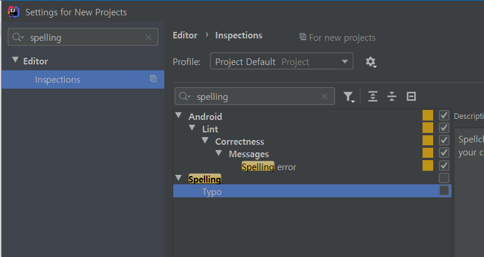

### Vue랑 Gradle 플러그인 설치 확인!!


## gradle : project structure 

## = eclipse : project properties / java build path


## project 3개 만듦

> (gradle-examples) vs (maven-examples) vs (native-examples)
>
> 3개 프로젝트로 이클립스와 비교하면서 실습!

프로젝트 생성은 new - project

---

메이븐 프로젝트 생성

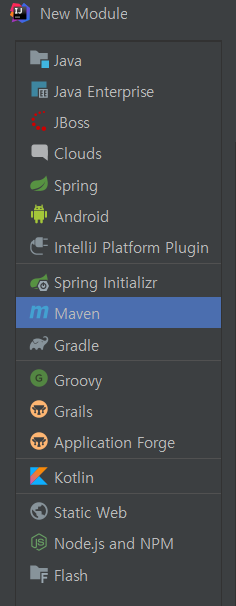ㅌ	

maven build

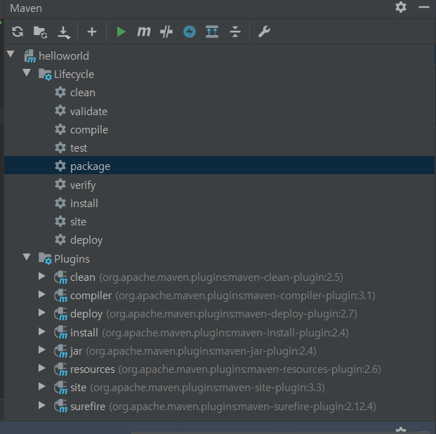


## maven-jar로 실행할때

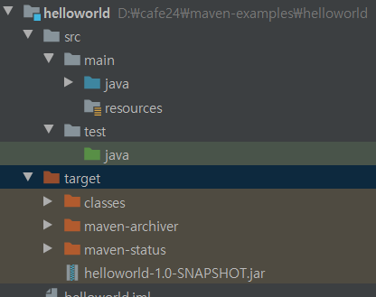

.\target\helloworld-1.0-SNAPSHOT.jar 밑에 class실행할때 **(소켓채팅할때 이렇게 했었음)**

```
D:\cafe24\maven-examples\helloworld>java -cp .\target\helloworld-1.0-SNAPSHOT.jar com.jung.helloworld.HelloWorld

> Hello World!
```


---

## gradle

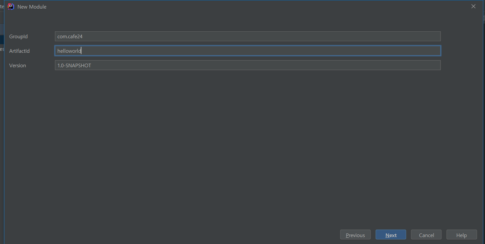


### 디펜던시

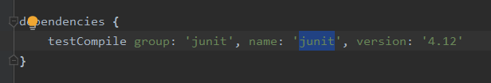

> testComplie > scope
>
> group -> groupId
>
> name ->artifa
>
> version -> version


### run task 설정하기

maven와 비교할 gradle IDEA 단독실행 모드 이해 

settings에서 설정

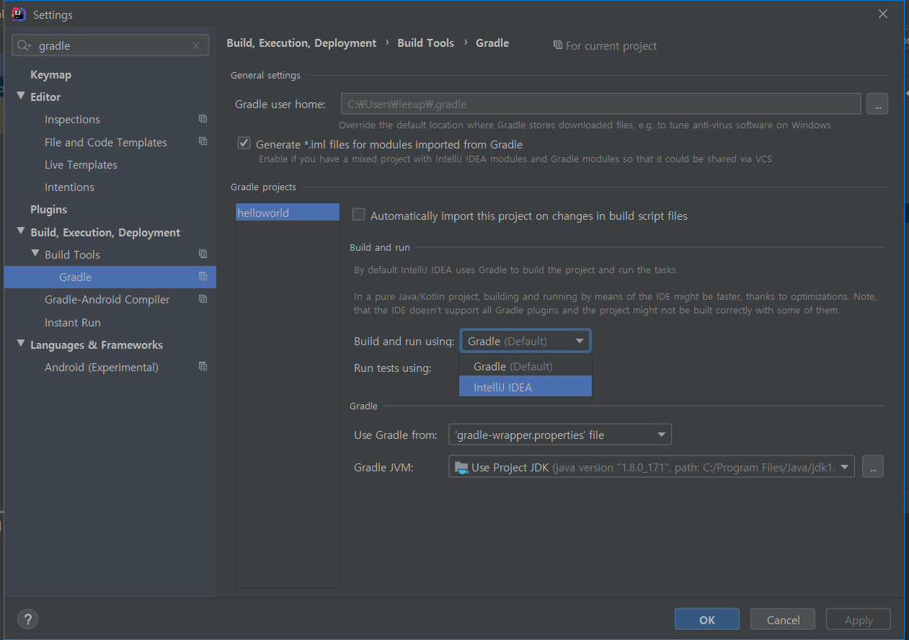

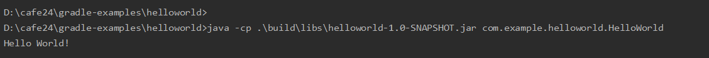


